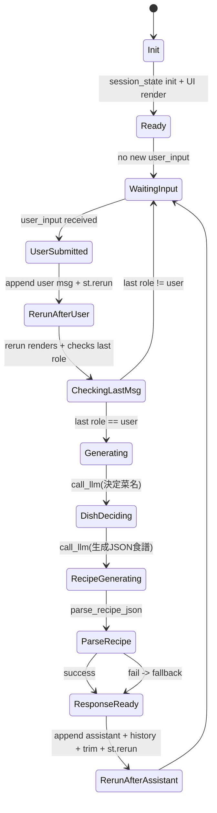
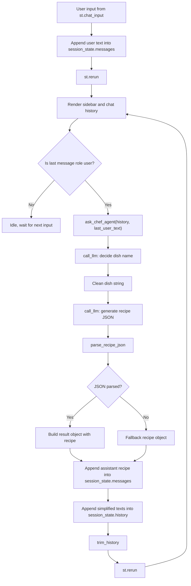

# TOC 2025 Final Project — Intelligent Agents with LLMs 


This project presents an Intelligent Culinary Agent designed to assist users in meal planning based on available ingredients, dietary constraints, and time limitations.


---


##  State Machine Diagram

## DAG



##  專案結構
```
.
├─ app.py                # Streamlit 主程式（Chef Agent）
├─ requirements.txt      
├─ README.md
├─ API.txt        

```

---

## How to Run

### 1) clone
```bash
git clone https://github.com/Crosonggg/TOC-2025-Final-Project.git
cd TOC-2025-Final-Project
```

### 2) Install required packages:
```bash
pip install -r requirements.txt
```
### 3) Configure API Key
將 `API.txt` 內容改成你的 API key：


### 4) run
```bash
streamlit run app.py
```

---


---


