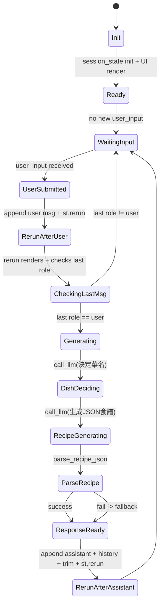

# TOC 2025 Final Project — Intelligent Agents with LLMs

This project presents an Intelligent Culinary Agent designed to assist users in meal planning based on available ingredients, dietary constraints, and time limitations.

---

## State Machine Diagram


```mermaid
stateDiagram-v2
    [*] --> Init

    Init --> Ready: session_state init + UI render
    Ready --> WaitingInput: no new user_input

    WaitingInput --> UserSubmitted: user_input received
    UserSubmitted --> RerunAfterUser: append user msg + st.rerun

    RerunAfterUser --> CheckingLastMsg: rerun renders + checks last role
    CheckingLastMsg --> Generating: last role == user
    CheckingLastMsg --> WaitingInput: last role != user

    Generating --> DishDeciding: call_llm(決定菜名)
    DishDeciding --> RecipeGenerating: call_llm(生成JSON食譜)
    RecipeGenerating --> ParseRecipe: parse_recipe_json

    ParseRecipe --> ResponseReady: success
    ParseRecipe --> ResponseReady: fail -> fallback

    ResponseReady --> RerunAfterAssistant: append assistant + history + trim + st.rerun
    RerunAfterAssistant --> WaitingInput
```

## 專案結構

```
.
├─ app.py                # Streamlit 主程式（Chef Agent）
├─ requirements.txt    
├─ README.md
├─ API.txt
```

---

## How to Run

### 1) clone

```bash
git clone https://github.com/Crosonggg/TOC-2025-Final-Project.git
cd TOC-2025-Final-Project
```

### 2) Install required packages:

```bash
pip install -r requirements.txt
```

### 3) Configure Gemini API Key

將 `API.txt` 內容改成你的 Gemini API key（只放金鑰本身，不要加引號或 `GEMINI_API_KEY=`）：

```text
AIza...
```

程式預設使用 `gemini-3.5-flash-lite`。若你的帳號要使用其他模型，可在啟動前設定 `GEMINI_MODEL` 環境變數。

> 請勿把含有真實金鑰的 `API.txt` 提交到 Git。若它已被追蹤，先執行 `git rm --cached API.txt`，再將檔案加入 `.gitignore`。

### 4) run

```bash
streamlit run app.py
```

---

---
